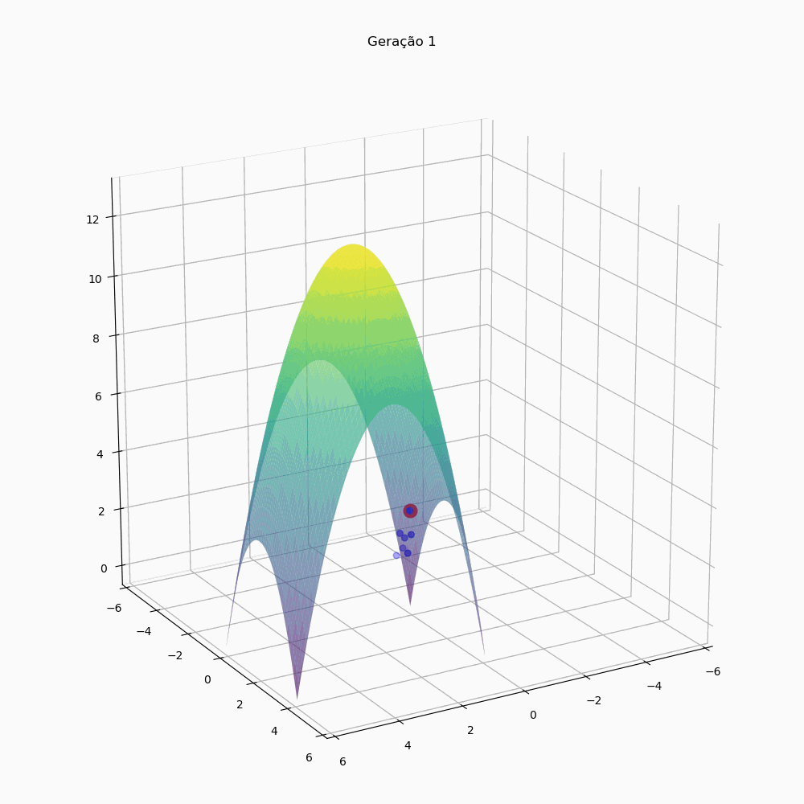

# Algoritmo Genético para Ponto Ótimo

Projeto desenvolvido como exercício da disciplina de Introdução à Inteligência Artificial, curso de Ciência de Dados, Universidade Presbiteriana Mackenzie.

Este projeto implementa um algoritmo genético simples para encontrar o ponto ótimo de uma função quadrática negativa, inspirado nos conceitos de evolução e seleção natural.

## Funcionamento

Este projeto implementa um algoritmo genético para encontrar o ponto ótimo de uma função matemática. Com efeito, o algoritmo pode encontrar o ponto ótimo de qualquer função; se a função cresce indefinidamente, o algoritmo continuará tentando encontrar valores cada vez maiores como resultado (o que seria redundante).

Chamamos de "candidato" cada indivíduo composto de valores para as variáveis de entrada. Esses indivíduos são selecionados iterativamente até que um resultado esperado (se informado) seja atingido.
O algoritmo segue os seguintes passos:

1. Cria um número de candidados-pais com atributos aleatórios;
2. Cada candidato-pai tem um número de candidatos-filhos com seus mesmos atributos;
3. Os candidatos-filhos sofrem mutação;
4. É medida a aptidão (resultado da função) dos candidatos-pais e dos candidatos-filhos;
5. Dentre todos os candidatos, os mais aptos sobrevivem para a próxima geração;
6. Se o valor máximo de aptidão nem a geração limite foram alcançados, os sobreviventes se tornam os candidatos pais da próxima geração (etapa 1).

Ao final, o algoritmo retorna a melhor solução encontrada para o problema.

## Como rodar

1. Clone o repositório ou baixe o arquivo Jupyter Notebook na pasta `pilot-function_genetic_solution`
2. Abra e execute o arquivo `function_genetic_solution.ipynb` no Jupyter Notebook

## Exemplo de saída

Obtém-se como retorno uma lista composta por dataframes, um para cada geração, cujas linhas são os melhores candidatos e cujas colunas são os atributos de entrada e a medida de aptidão.

Esses dataframes são usados para deteminar os pontos no gráfico, mostrando sua evolução.

## Estrutura do repositório

- `function_genetic_solution/`
  - `function_genetic_solution.ipynb` - Notebook com implementação do algoritmo genético

## Próximos passos

- Adaptação para ajuste de regressão linear via algoritmo genético
- Aplicação em dataset real (odds de apostas no futebol brasileiro)

## Contribuição

Sugestões, críticas e contribuições são bem-vindas!

## Licença

MIT